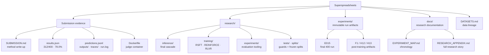

# Superspreadsheets

### Improving spreadsheet reliability with failure-driven, generalization-oriented systems design.

Built solo for the **Ylookup × Encode AI Hackathon — Research Track** (5–6 September 2026).

Given an Excel workbook and a natural-language instruction, the system must return the modified workbook. A task passes only when **every graded cell is correct after LibreOffice recalculation** — one wrong cell fails the task. The required model is `Qwen/Qwen3.8-27B`, and we kept it untouched in the submitted configuration. We treated the weekend as an ML-systems reliability problem rather than prompt tuning:

> measure failures → identify the mechanism → change one thing → evaluate → keep only what survives.

## Results

| Evaluation | Exact task pass rate |
|---|---:|
| Organizer one-shot reference (organizer-advertised, not re-measured by us) | 59.0% |
| **Our final public 400-task run (E015)** | **78.0% — 312/400** |
| Fixed dev split (n=60) | 85.0% — 51/60 |
| Held-out local test, touched exactly once (n=60) | 91.67% — 55/60 |

These are **different evaluation sets, not repeated measurements of the same sample** — the 91.67% is our internal held-out split, not a public-benchmark figure.

Final full-400 detail: **312/400 exact pass**, cell-level task pass 83.64%, sheet-level task pass 65.6%, items/graded/missing/errors = 400/400/0/0 ([results.json](results.json)). Against our earlier full-400 champion (E009, 76.25%), the finalist produced **22 FAIL→PASS and 15 PASS→FAIL transitions, net +7 tasks** — and the fixed tasks fall in exactly the failure classes the added mechanisms target.

## Repository at a glance



The detailed layer — annotated tree, canonical-vs-historical classification, reading paths by audience — is [REPOSITORY_MAP.md](REPOSITORY_MAP.md).

## Research goal: improve reliability, not just benchmark fit

The core question we set out to test:

> Can a relatively small model become more reliable at spreadsheet work through mechanisms that should transfer to workbooks and instructions outside the specific public benchmark tasks?

We deliberately did not optimize around task IDs or golden-answer-specific patches. Every accepted change is a generic model-runtime or spreadsheet-semantics mechanism, and the evaluation was structured to preserve evidence that the system works on data not used for iteration.

### What the evaluation sets mean

For development and post-training, we partitioned the 400 public tasks once, up front, and the labels below are used throughout this README:

- **TRAIN — 280 tasks.** The 280 public tasks reserved for training-side research: rollout analysis, reward construction and post-training. Not every experiment uses all 280.
- **DEV — 60 tasks.** A fixed internal development set, used repeatedly to compare hypotheses in controlled one-change ablations.
- **LOCAL TEST — 60 tasks.** An internal held-out set deliberately never inspected during development; evaluated exactly once, after the finalist configuration was frozen.
- **PUBLIC 400.** The complete public SpreadsheetBench benchmark — the union of the three splits above (280 + 60 + 60), **not a fourth disjoint set**. Full-400 runs are sparse, frozen measurements of the entire public set.
- **PRIVATE HOLDOUT.** A separate organizer-run set of unseen spreadsheets. We do not know its result.

## Why the improvements should transfer

**Protected held-out data.** The 400 public tasks were frozen into 280 train / 60 dev / 60 local_test (seed 42, checksum-guarded). All iteration ran on train and dev. local_test was touched **exactly once**, only after the finalist was frozen, and scored 91.67%. This provides evidence that the finalist was not merely tuned to the dev set — it is not proof of arbitrary out-of-distribution generalization.

**The public 400 as measurement, not tuning loop.** Full-400 runs (E009, then E015) were single measurements of frozen configurations. Post-hoc failure analysis informed *hypotheses*, which were then developed on train and validated on dev before any refrozen configuration was measured again.

**Generic mechanisms instead of task-specific fixes.** Each accepted mechanism encodes spreadsheet or model-runtime semantics that hold regardless of benchmark identity: typed date/time cells (Excel semantics), sheet-qualified addressing (real workbooks reuse coordinates across sheets), merged-cell-safe writing, recalculating **our own output** to detect formula errors, conditional context expansion (any large workbook can hide relevant cells outside a fixed serialization window), truncation detection with token escalation (an output-budget property of the model system), structural completeness/type invariants, and conservative artifact selection that never replaces a known-good path without evidence. None of these read task IDs or golden values.

**Rejected brittle improvements.** Generalization discipline also meant rejecting local wins with high regression risk: formulas-everywhere converted 3 never-solved tasks but regressed 8; best-of-N selection let blind candidates outvote a sighted artifact; patch repair lost to consensus-wrong outputs. We preferred mechanisms with a clear causal model and low regression surface over locally attractive score changes.

**Evaluation ladder.**

```text
TRAIN (280)      mechanism discovery, reward construction
   ↓
DEV (60)         controlled one-change-at-a-time validation
   ↓
LOCAL_TEST (60)  untouched until finalist freeze, single confirmation
   ↓
PUBLIC 400       frozen measurement (E009, E015)
   ↓
PRIVATE HOLDOUT  judge-run unseen spreadsheets — the strongest external test
```

We do not know the private-holdout result; the ladder is designed so that it should not be a surprise.

## The system

The final system is a conservative inference cascade around Qwen3.8-27B that spends extra compute only when there is golden-free evidence that the ordinary path is failing.

```text
workbook + instruction
        │
        ▼
┌─────────────────────────┐
│ Qwen3.8-27B             │
│ values-first solve      │
│ 24,576 token budget     │
└────────────┬────────────┘
             │
             ▼
      golden-free checks
             │
       ┌─────┴─────┐
       │           │
    healthy     distressed /
       │        view-doomed
       │           │
       │           ▼
       │   expanded workbook view
       │   formula-capable solve
       │   32,768 token budget
       │           │
       │     evidence-fed repair
       │           │
       └─────┬─────┘
             ▼
      structural invariants
             │
             ▼
       artifact selection
             │
             ▼
 typed + sheet-aware writer
             │
             ▼
   LibreOffice recalculation
             │
             ▼
        final workbook
```

In execution order: a **values-first champion attempt** (baseline 120×30 serialization, 24,576 tokens), skipped only on provable unwinnability (answer range over 300 cells, or answer cells outside the serialized view); **golden-free health checks** on our own artifact — truncation, parse damage, static formula issues, Excel error values after recalculating our own output; **gated escalation** to an expanded coverage serializer with formula-visible cells and a formula-permitting prompt at 32,768 tokens, followed by one **evidence-fed repair** quoting the concrete defect list; **structural invariants** (requested-range completeness, column-type consistency) triggering at most one repair whose writes are restricted to a **changed-cell allowlist**; **conservative selection** of the healthiest artifact with ties to the champion, so the per-task worst case is the champion's own output; and a **writer** that produces typed ISO dates/times, prefixes modern functions for LibreOffice, unmerges target ranges before writing, and uses **sheet-qualified addresses** whenever the answer range spans sheets.

## Key experiments and measurements

| Exp | One change | Evaluation set | N | Pass | Flips | Verdict |
|---|---|---|---:|---:|---|---|
| E001 | untouched starter | Dev | 60 | 46.7% | — | measured floor |
| E002 | token budget 8k → 24k | Dev | 60 | 61.7% | +9 / −0 | adopted |
| E003 | typed Excel writes (dates as dates) | Dev | 60 | 76.7% | +9 / −0 | adopted |
| E004 | salvage parser + unmerge | Dev | 60 | 78.3% | +1 / −0 | adopted |
| E006 | formulas everywhere | Dev | 60 | 70.0% | +3 / −8 | **negative** |
| E008 | evidence cascade | Dev | 60 | 83.3% | +3 / −0 | adopted |
| E009 | champion cascade | Public benchmark | 400 | 76.25% (305/400) | — | first frozen full-400 measurement |
| E013 | structural repair + multi-sheet | Dev | 60 | 85.0% | +2 / −1 | adopted → finalist |
| E014 | risk-gated best-of-N | Dev | 60 | 80.0% | +1 / −4 | **negative** |
| E015 | frozen finalist | Public benchmark | 400 | **78.0%** | +22 / −15 vs E009 | **final submission measurement** |

The Dev rows are development-set experiments on the same fixed 60 tasks; E009 and E015 are frozen measurements across the complete 400-task public benchmark — a different evaluation scope, so 78.0% is not a drop from 85.0% on the same sample.

### Research lineage

The repository preserves append-only experiment IDs — runs are never renamed after they execute, so manifests and diffs stay verifiable. The decoder and full chronology live in [docs/EXPERIMENT_MAP.md](docs/EXPERIMENT_MAP.md); the six stages in one line: baseline → runtime/representation fixes → evidence-gated cascade → full-400 audit → residual-tail mechanisms → post-training.

A few simple mechanisms produced most of the gain; later mechanisms showed diminishing returns; the negative experiments materially shaped the final architecture.

**Three findings worth keeping:**

1. **Token budget.** At the 8k starter budget, truncation dominated failures; raising it to 24k fixed 9 dev tasks with zero regressions. Some apparent reasoning failures were incomplete-output failures.
2. **Spreadsheet representation.** Writing dates as typed cells fixed 9 more dev tasks — validated by replaying stored responses through the new write path at **zero additional model calls**. Deterministic spreadsheet semantics belong in the harness, not necessarily in model weights.
3. **More freedom can hurt.** Unrestricted formula use converted 3 never-solved tasks and regressed 8. The capability existed; the policy was wrong. This negative result is why formula mode is gated on evidence rather than universal.

## Negative results

Kept deliberately, because they reduced uncertainty and shaped the system: **E006** formulas everywhere (+3/−8, rejected); **E014** best-of-N selection (net −3: candidates sampled with the champion prompt outvoted the sighted escalation artifact on view-doomed tasks); **patch repair** (0 conversions, 1 regression — consensus-wrong answers defeat golden-free triggers); **E012** first RSFT attempt (dev collapsed ~30 points across three variants; forensics traced it to thinking-stripped SFT targets — median 253 tokens against successful trajectories of thousands); **corrected RSFT** (collapse eliminated, plasticity ≈ control); **H12 reward ablation** (continuous/discrete/hybrid rewards all safe, none above control).

## Post-training: investigated seriously, reported by what it measured

Terminology stays precise throughout — LoRA is the parameter-efficient update mechanism (rank 32 in every arm); SFT is an imitation objective; RLVR is verifier-grounded outcome optimization. These are different things and the table treats them as such. Evaluation shorthand: the *canary* is a frozen 24-task safety probe (12 sentinels the base system reliably passes + 12 opportunity near-misses, base control 2/12).

| Iteration | Hypothesis / change | Training scale | Evaluation | Measured result | Reflection |
|---|---|---|---|---|---|
| E012 first RSFT | verifier-approved trajectories improve reliability | 3 LoRA variants | dev60 | collapse: 78.3% → 41.7–46.7% | trajectory representation was broken — targets were thinking-stripped (median 253 tokens); not evidence against RSFT itself |
| Corrected RSFT | exact raw sampled tokens, reasoning preserved (F0 integrity gate) | 253 examples, lr 1e-5 / 2e-5 | canary | 12/12 sentinels; opportunity 2/12 = control | stability solved; constructive plasticity not demonstrated |
| H12 reward ablation | reward geometry is the bottleneck | REINFORCE, 56-group frozen variance band; R0 continuous / R1 discrete / R2 hybrid | canary ×3 | 13, 13, 14 of 24; none above control | discrete R1 left ~half the groups gradient-dead as predicted offline; changing signal density was not sufficient at this budget |
| H13B hard-mined expert iteration | easy-data dilution suppressed learning | 100 hard-mined examples, 2 passes | canary | 12/12 sentinels; opportunity 1/12 | easy-data dilution was not the whole problem |
| H13A online RLVR | fresh on-policy rollouts + importance-sampled updates on boundary tasks | 51 groups, K=8, 20 optimizer updates | step-8 canary; final eval pending | step-8: 14/24, passing exactly the control's opportunity tasks | neutral at mid-training; **final-checkpoint evaluation had not finalized at README freeze** |
| H13C broad online RLVR | boundary mining was too narrow — train on the full distribution | 269/280 sampleable tasks (11 unsampleable whales excluded, listed), K=4, 14 updates, 1,120 fresh episodes | final eval pending | training completed to full coverage | **evaluation had not finalized at README freeze** — no conclusion reported |

**Interim snapshot (11:50, larger H13A evaluations still running):** on a frozen 100-task sample drawn from train tasks H13A *never trained on*, the first 45 matched completions score **H13A 31/45 (68.9%) vs base 30/45 (66.7%)** under an identical single-pass protocol — one H13A-only win, zero H13A-only losses. Direction-consistent with its final canary (+1 opportunity conversion, zero regressions), still within single-task noise; the full 100-task and dev60 measurements finalize post-submission.

**Completed evidence:** every corrected arm holds **12/12 sentinels — zero capability collapses** — so the trajectory-integrity fix demonstrably solved destructive training. But safe ≠ better: **no completed arm has produced a measured exact-pass improvement over the base+harness control**, and the submitted 78.0% is attributable to the harness, not post-training.

**What may have limited the post-training result** — hypotheses and limitations, not measured causal facts: the 12-task opportunity canary has low statistical power for +1–2pp effects; dev60 itself carries measured ±3–4-task run-to-run variance; H13A/H13C received only 20/14 optimizer updates, which could have been too shallow a dose; the RL environment trains a single-turn 16k-token solver while the submitted system is a multi-stage cascade at 24k/32k, a train/inference mismatch we cannot rule out as limiting; sparse terminal reward over thousands-of-token trajectories makes credit assignment hard at the tested budget; and 11 whale tasks cannot fit the textual context interface at all, capping what any policy could learn about them.

## Evaluation and anti-overfit discipline

Fixed 280/60/60 split; local_test one-touch. Scoring is exclusively the upstream official evaluator (LibreOffice recalculation, judges' `--all` mode) — no custom scorer anywhere. Golden answers are readable only by evaluation and TRAIN-side reward construction, never by runtime inference — enforced by automated tests ([research/tests/](research/tests/)) and trace audits over both full-400 runs (clean: no golden content in any prompt, no task-ID lookups). Temperature-0 sampling still flips ±3–4 dev tasks between runs — measured on byte-identical prompts — so attribution used stored-response replay and matched controls rather than headline deltas.

## Reproduction

```sh
# build (repo root)
docker build -t superspreadsheets .

# run — reads /data read-only, writes /out, unattended
docker run --rm \
  -e TINKER_API_KEY \
  -e TINKER_PROJECT_ID \
  -v <dataset-dir>:/data:ro \
  -v <empty-output-dir>:/out \
  superspreadsheets
```

No credentials are committed; the two environment variables above are required (the hackathon key's default project is read-only — the team project id is needed). Final cold retest of the container on a golden-free dataset copy: **PASS** (2026-09-06).

```sh
# finalist local inference
cd research && uv run inference/cascade_predict.py --out-dir <out> \
  --base-model Qwen/Qwen3.8-27B --ids <ids> --concurrency 6 \
  --max-tokens 24576 --escalation-max-tokens 32768

# official evaluation
uv run evaluate.py --predictions <predictions.jsonl> --all --out results.json
```

## Submission contents

Everything a judge needs, one click each: [SUBMISSION.md](SUBMISSION.md) (required method write-up) · [Dockerfile](Dockerfile) (judge container) · [results.json](results.json) (scored public-400: 78.0%) · [predictions.jsonl](predictions.jsonl) · [outputs/](outputs/) · [traces/](traces/) · [run.log](run.log) · [DATASETS.md](DATASETS.md) (data lineage) · [corrected RSFT corpus](experiments/F1v2-rollouts-reasoning-preserved/sft_dataset_v2.jsonl) · [first-generation corpora](experiments/F1-rollouts/) · [H13A](experiments/H13A-online-rlvr/) / [H13C](experiments/H13C-fulltrain-rlvr/) RLVR artifacts · [research/splits/](research/splits/) · [docs/RESEARCH_APPENDIX.md](docs/RESEARCH_APPENDIX.md) · [EXPERIMENTS.md](EXPERIMENTS.md) · [docs/EXPERIMENT_MAP.md](docs/EXPERIMENT_MAP.md)

## Repository guide

**New to the repository? Start with [REPOSITORY_MAP.md](REPOSITORY_MAP.md)** — the annotated map of the whole tree, canonical-vs-historical classification, and reading paths by audience. The major areas:

| Area | Canonical path |
|---|---|
| Submission (container + run evidence) | [Dockerfile](Dockerfile) · [SUBMISSION.md](SUBMISSION.md) · [results.json](results.json) + the four runtime outputs at root |
| Inference (the final system) | [research/inference/](research/inference/) |
| Training (post-training machinery) | [research/training/](research/training/) |
| Experiments (run artifacts) | [experiments/](experiments/) — index: [experiments/README.md](experiments/README.md) |
| Datasets (lineage) | [DATASETS.md](DATASETS.md) |
| Research docs | [docs/](docs/) — index: [docs/README.md](docs/README.md) |
| Tests (integrity guards) | [research/tests/](research/tests/) |

## Takeaway

A large fraction of apparent model failures were actually failures of context allocation, spreadsheet representation, validation, or routing — and those can be measured and fixed without changing the underlying model. Post-training became reliably non-destructive once trajectory representation was fixed, but completed training runs had not yet produced a measured exact-pass improvement over the base+harness at README freeze. The final public result: **312/400 = 78.0%**, with a one-touch held-out local_test result of **55/60 = 91.67%**.
